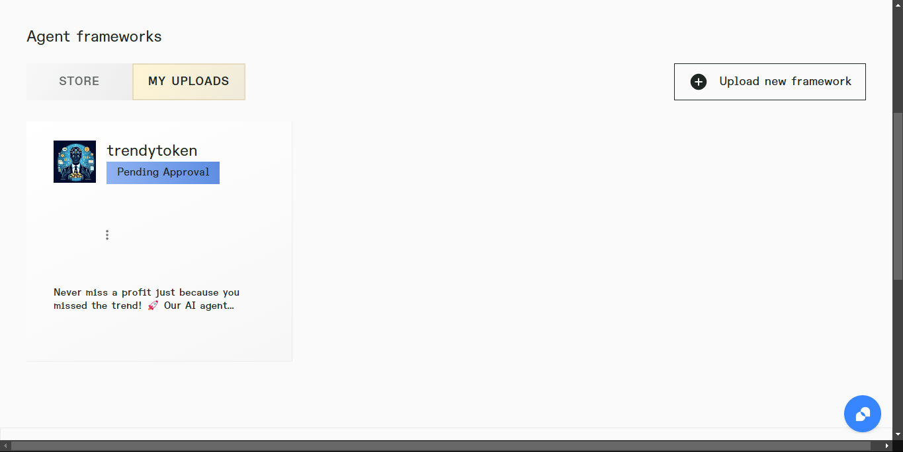

# Trendy-Tokens-AI 🚀

Never miss a profit just because you missed the trend! Our AI agent scrapes platforms like Twitter & CoinGecko to find trending tokens in Meme, DeFi, ZK & AI—then invests for you! 

## 🌟 Features

- **Real-time Market Analysis**: 
  - Automated tracking of top tokens across multiple categories
  - Price movement analysis
  - Volume and market cap monitoring
  - Risk level assessment
- **Smart Investment Strategies**:
  - Category-specific analysis (Meme, DeFi, AI, ZK)
  - Liquidity scoring
  - Automated trading with slippage protection
  - Portfolio risk management
- **Trend Detection**:
  - Real-time keyword monitoring
  - Social sentiment analysis
  - Viral trend prediction
  - Early memecoin opportunity identification
- **Autonomous Operations**:
  - Self-executing trading strategies
  - Continuous market monitoring
  - Automated decision making
  - Risk-adjusted position sizing

---
We have uploaded our framework on Autonome, but need approval from the autonome team.
Here it is

As soon as it is approved, we can get our API and we can integrate it will our frontend deployed here: [Frontend Deployed Link](https://ai-agent-coins.vercel.app/)
---

## 🛠️ Technical Architecture

### Backend Components

- **Agent System**: Built with Coinbase AgentKit
  - Custom action providers for each token category
  - Autonomous and interactive chat modes
  - Memory management system
  - Real-time stream processing

- **Market Analysis Engine**:
  - Risk level assessment algorithm
  - Liquidity ratio calculation
  - Volatility monitoring
  - Market depth analysis

- **Smart Contract Integration**:
  - Automated swap transactions
  - ERC-20 token deployment
  - Balance management
  - Security checks

### Frontend Application
Deployed at: [Frontend Deployed Link](https://ai-agent-coins.vercel.app/)

Built with Next.js and Tailwind CSS, offering:
- Responsive dashboard interface
- Real-time market data visualization
- Portfolio management tools
- Transaction history tracking
- Trend analysis charts

## 🚀 Getting Started

### Prerequisites

#### Node.js Installation
Ensure you have Node.js 18 or higher installed:
```bash
node --version
```

If you need to upgrade, use nvm:
```bash
nvm install node
```

#### Required API Keys
```
CDP_API_KEY_NAME=your_key_name
CDP_API_KEY_PRIVATE_KEY=your_private_key
OPENAI_API_KEY=your_openai_key
COINGECKO_API_KEY=your_coingecko_key
APIFY_KEYWORDS_API_KEY=your_apify_key
```

### Installation

1. Clone the repository:
```bash
git clone https://github.com/your-username/trendy-tokens-ai.git
cd trendy-tokens-ai
```

2. Install dependencies:
```bash
npm install
```

3. Build the project:
```bash
npm run build
```

### Running the Application

#### Backend Agent
```bash
cd backend
npm start
```

Select your preferred mode:
- Chat mode: Interactive command interface
- Auto mode: Autonomous trading operations

#### Frontend Dashboard
```bash
cd frontend
npm run dev
```

Access the dashboard at `http://localhost:3000`

## 💡 Usage Examples

### Agent Commands

```bash
# Market Analysis
"Analyze top 10 AI tokens"
"Check DeFi trends in the last 24 hours"
"Show me trending ZK projects"

# Investment Operations
"Invest 0.5 ETH in trending meme tokens"
"Set up a portfolio across all categories"
"Monitor viral keywords for potential memecoins"

# Token Deployment
"Deploy an ERC-20 based on trending keyword X"
"Create a memecoin with viral potential"
```

### Risk Management Features

The system employs sophisticated risk assessment:
- Liquidity Ratio Analysis: `volume/marketCap`
- Risk Level Categories:
  - VERY_HIGH: Low liquidity (<5%) or high volatility (>50%)
  - HIGH: Moderate liquidity (5-10%) or significant volatility (30-50%)
  - MEDIUM: Good liquidity (10-15%) or normal volatility (20-30%)
  - LOW: Excellent liquidity (>15%) and stable price action

## 🔧 Technical Implementation

### Agent Configuration
- Implements CDP AgentKit with custom action providers
- Uses LangChain for natural language processing
- Maintains persistent wallet data
- Implements memory management for conversation context

### Trading Logic
- Slippage protection mechanisms
- Balance verification before trades
- Transaction failure handling
- Automated position sizing

### Market Analysis
- Multi-category trend analysis
- Volume-based liquidity scoring
- Price movement tracking
- Social sentiment integration

## ⚠️ Security Features

- Contract verification
- Balance checks
- Slippage protection
- Risk level assessment
- Transaction monitoring

## 📝 License

Apache-2.0

## 🤝 Contributing

We welcome contributions! Please read our [Contributing Guidelines](CONTRIBUTING.md) before submitting pull requests.

## 📞 Contact & Support

- GitHub Issues: Create an issue in this repository
- Discord: [Join our community](Coming Soon)
- Twitter: [@TrendyTokensAI](Coming Soon)
- Email: support@trendytokens.ai

---

Built with 💙 by the Trendy-Tokens-AI Team
